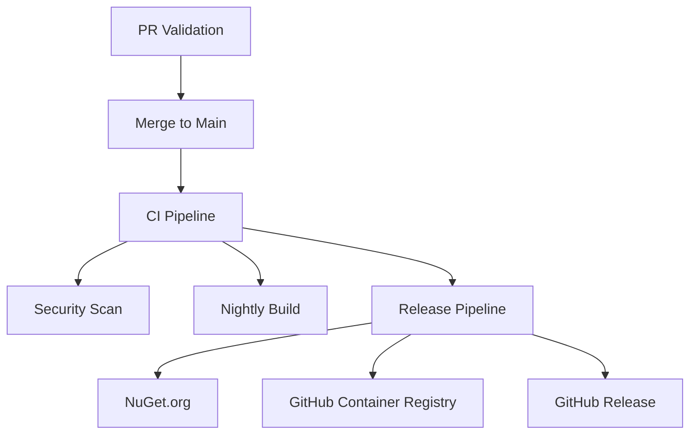

# GitHub Actions Workflows - Ghost Framework

Enterprise-grade CI/CD workflows for the Ghost stealth browser automation framework.

## 📁 Workflow Files

### 1. `pr-validation.yml` - Fast PR Feedback
**Trigger:** Pull requests to main  
**Duration:** < 10 minutes  
**Purpose:** Fast feedback for developers

**Jobs:**
- ✅ **Validate PR Title** - Conventional commits format
- 🧹 **Lint & Format Check** - Code style validation
- 🏗️ **Build Solution** - Full solution build with warnings as errors
- 🧪 **Test** - Unit tests only (excludes E2E)
- 🔍 **Check Migrations** - Validates no DotnetSpider references added
- 📊 **PR Summary** - Aggregated results posted to PR

**Optimizations:**
- Parallel job execution
- NuGet package caching
- Concurrency control (cancel old runs)
- Artifact retention: 1-7 days

---

### 2. `ci.yml` - Main Integration Pipeline
**Trigger:** Push to main  
**Duration:** 30-45 minutes  
**Purpose:** Comprehensive validation and artifact generation

**Jobs (Parallel):**

#### Build & Test
- 🏗️ **Build Solution** - Release configuration
- 🧪 **Unit Tests** - All unit tests with coverage
- 🔗 **Integration Tests** - Integration test suite with Playwright
- 🌐 **E2E Tests** - E2E tests split across 2 shards

#### Security
- 🔒 **CodeQL Analysis** - SAST security scanning
- 📦 **Dependency Scan** - Vulnerable package detection
- 🔑 **Secret Detection** - Gitleaks scanning

#### Artifacts
- 📦 **Package Artifacts** - NuGet packages with semantic versioning
- 📋 **Generate SBOM** - Software Bill of Materials (SPDX JSON)

**Versioning:**
- Format: `1.0.0.{github.run_id}`
- Build number uses `github.run_id` (globally unique, never resets)

**Artifact Retention:**
- Build artifacts: 7 days
- Test results: 7 days
- NuGet packages: 30 days
- SBOM: 30 days

---

### 3. `release.yml` - Release Automation
**Trigger:** Manual workflow dispatch or version tags  
**Duration:** 30-60 minutes  
**Purpose:** Publish releases to NuGet and container registries

**Jobs:**

#### Version Management
- 🏷️ **Calculate Version** - Semantic versioning (MAJOR.MINOR.PATCH.BUILD)
- 📝 **Generate Changelog** - Auto-generated from commits
- 🏷️ **Create Git Tag** - Automated tagging

#### Build & Publish
- 🏗️ **Build and Test** - Full test suite validation
- 📦 **Create NuGet Packages** - Multi-project packaging
- 🚀 **Publish to NuGet.org** - Public package distribution
- 🐳 **Build Docker Image** - Container image with multi-layer caching
- ✍️ **Sign Container** - Cosign image signing
- 📋 **Generate SBOM** - Container and package SBOM

#### Release
- 📢 **Create GitHub Release** - Release notes with changelog
- 📊 **Release Summary** - Aggregated results

**Versioning Strategy:**
```
Standard: 1.2.3.{run_id}
Prerelease: 1.2.3-alpha.{run_id}
```

**Container Registry:** `ghcr.io/{org}/ghost-webapi`

**Security:**
- Container signing with cosign
- SBOM attestations (SPDX + CycloneDX)
- Vulnerability scanning before release

---

### 4. `security-scan.yml` - Deep Security Analysis
**Trigger:** Daily at 2 AM UTC, manual, or dependency changes  
**Duration:** 45-60 minutes  
**Purpose:** Comprehensive security posture monitoring

**Jobs:**

#### Code Analysis
- 🔍 **CodeQL SAST** - Extended security queries
- 📦 **Dependency Vulnerability Scan** - Transitive dependency checking
- 🔑 **Secret Detection** - Gitleaks with custom rules

#### Container Security
- 🐳 **Container Scan** - Trivy vulnerability scanning
- 📋 **SBOM Generation** - SPDX + CycloneDX formats
- ⚖️ **License Compliance** - Package license audit

**Features:**
- Auto-creates GitHub issues for vulnerabilities
- SARIF upload to GitHub Security tab
- Daily scheduled scans
- 30-day artifact retention

**Security Thresholds:**
- Container scan: CRITICAL, HIGH, MEDIUM vulnerabilities
- Dependency scan: All vulnerable packages reported
- Secret detection: Zero tolerance

---

### 5. `nightly.yml` - Long-Running Tests
**Trigger:** Daily at 3 AM UTC or manual  
**Duration:** 2-3 hours  
**Purpose:** Stability and performance validation

**Jobs:**

#### Comprehensive Testing
- 🔗 **Full Integration Tests** - All integration tests
- 🌐 **E2E Full Suite** - Cross-browser testing (Chromium, Firefox, WebKit)
- ⚡ **Performance Benchmarks** - BenchmarkDotNet suite
- 🎯 **Stability Tests** - 10x critical test runs for flakiness detection
- 📊 **Full Code Coverage** - Coverage with 80% threshold

**Features:**
- Auto-creates issues on failure
- Flakiness detection (< 90% pass rate)
- Performance regression detection
- Coverage reports with HTML output

**Artifact Retention:** 30 days for all nightly artifacts

---

## 🔧 Reusable Action

### `setup-ghost` Action
Location: `.github/actions/setup-ghost/`

**Purpose:** Standardized environment setup

**Features:**
- .NET SDK setup with global.json
- NuGet package caching
- Optional Playwright installation
- Environment summary display

**Usage:**
```yaml
- uses: ./.github/actions/setup-ghost
  with:
    dotnet-version: '10.0.x'
    install-playwright: 'true'
    playwright-browsers: 'chromium'
```

---

## 🔐 Required Secrets

Configure these in repository settings:

| Secret | Purpose | Required For |
|--------|---------|--------------|
| `NUGET_API_KEY` | NuGet.org publishing | release.yml |
| `COSIGN_PRIVATE_KEY` | Container signing | release.yml |
| `COSIGN_PASSWORD` | Cosign key password | release.yml |
| `GITHUB_TOKEN` | Automatic (provided by GitHub) | All workflows |

---

## 📊 Workflow Optimization

### Caching Strategy
- **NuGet Packages:** Based on `**/*.csproj` hash
- **Docker Layers:** GitHub Actions cache
- **Playwright Browsers:** One-time install per job

### Parallel Execution
- PR validation: Lint + Build + Test in parallel
- CI: 9 parallel jobs (build, tests, security, artifacts)
- E2E: Sharded across multiple runners

### Concurrency Control
- PR validation: Cancel in-progress on new push
- CI main: No cancellation (preserve artifacts)
- Nightly: No cancellation (long-running)

---

## 📈 Quality Gates

### PR Validation
- ✅ Conventional commit title format
- ✅ Code formatting (dotnet format)
- ✅ Build with warnings as errors
- ✅ Unit tests pass
- ✅ No DotnetSpider references added

### CI Main Branch
- ✅ All tests pass (unit, integration, E2E)
- ✅ CodeQL security scan clean
- ✅ No vulnerable dependencies
- ✅ No secrets detected
- ✅ Artifacts generated successfully

### Release
- ✅ Full test suite passes
- ✅ NuGet packages published
- ✅ Container images signed
- ✅ SBOM generated
- ✅ GitHub release created

### Nightly
- ✅ 80% code coverage minimum
- ✅ 90% stability pass rate
- ✅ Performance benchmarks complete
- ✅ Cross-browser E2E tests pass

---

## 🚀 Usage Examples

### Creating a Release

**Manual Release:**
```bash
# Go to Actions > Release > Run workflow
# Select bump type: patch/minor/major
# Check "Is prerelease" if needed
```

**Tag-based Release:**
```bash
git tag v1.2.3
git push origin v1.2.3
```

### Running Security Scan
```bash
# Go to Actions > Security Scan > Run workflow
```

### Running Nightly Build
```bash
# Go to Actions > Nightly Build > Run workflow
```

---

## 🔄 Workflow Dependencies



---

## 📝 Version Strategy

**Format:** `MAJOR.MINOR.PATCH.BUILD`

**Components:**
- **MAJOR:** Breaking changes (manual bump)
- **MINOR:** New features (manual bump)
- **PATCH:** Bug fixes (manual bump)
- **BUILD:** `github.run_id` (automatic, globally unique)

**Example Versions:**
- Production: `1.2.3.456`
- Prerelease: `1.2.3-alpha.456`

**Why github.run_id?**
- Globally unique across all repositories
- Never resets (incremental)
- Deterministic (no race conditions)
- Perfect for build metadata

---

## 🎯 Success Metrics

**PR Feedback Time:** < 10 minutes  
**CI Pipeline Time:** < 45 minutes  
**Release Time:** < 60 minutes  
**Nightly Build Time:** < 3 hours

**Coverage Target:** 80% minimum  
**Stability Target:** 90% pass rate  
**Security Scans:** Daily + on-demand

---

## 🛠️ Maintenance

### Adding New Tests
1. Tests automatically detected by test filter patterns
2. Update filters in workflows if categorization changes
3. Consider adding to nightly build for long-running tests

### Adding New Projects
1. Builds automatically detect new `.csproj` files
2. Ensure proper test categorization (Unit/Integration/E2E)
3. Update packaging if new public libraries

### Updating Dependencies
1. Dependency scans run daily
2. Issues auto-created for vulnerabilities
3. Update `global.json` for .NET version changes

---

## 📚 References

- [GitHub Actions Documentation](https://docs.github.com/en/actions)
- [.NET Testing Best Practices](https://docs.microsoft.com/en-us/dotnet/core/testing/)
- [Semantic Versioning](https://semver.org/)
- [CodeQL Documentation](https://codeql.github.com/docs/)
- [Cosign Container Signing](https://docs.sigstore.dev/cosign/overview/)
