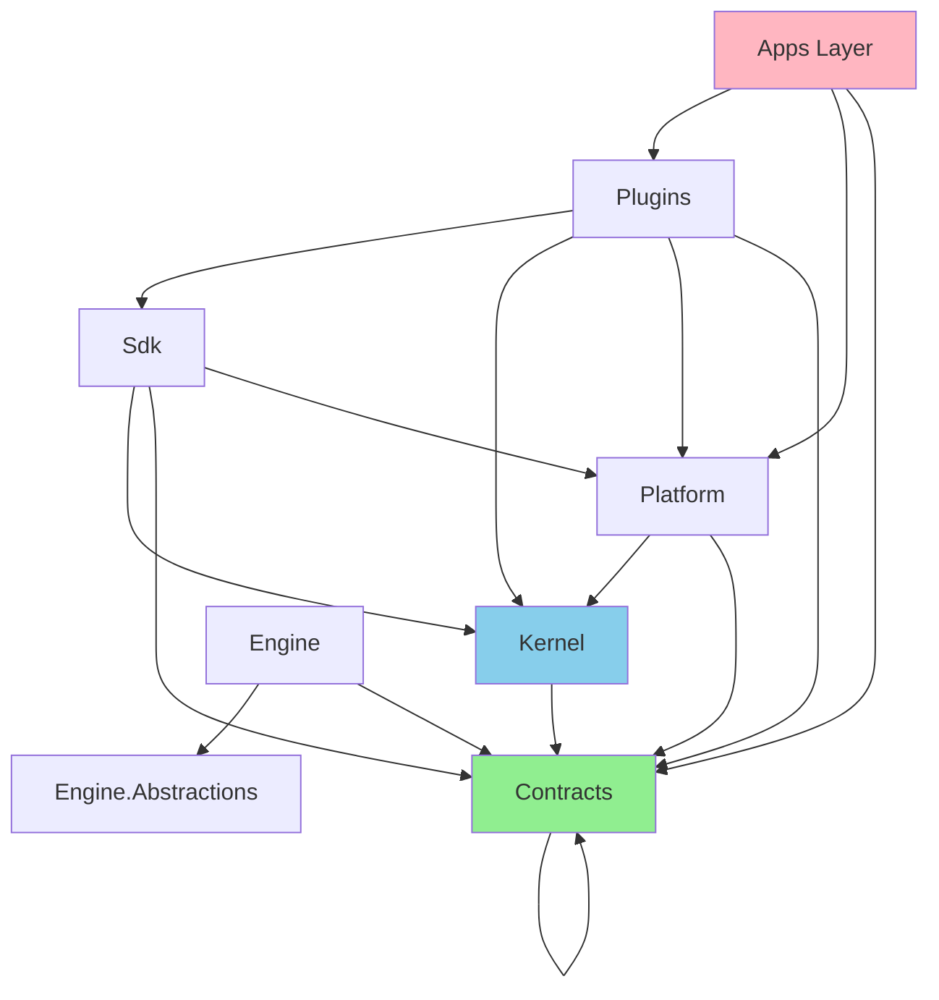

# Ghost .NET 10 Scraping Platform - Comprehensive Codebase Analysis

**Analysis Date:** February 28, 2026  
**Repository:** Ghost - .NET 10 Scraping Platform  
**Analyst:** dotnet-architect (AI Agent)  
**Scope:** 664 C# source files, 7-layer architecture, 100+ projects

---

## Executive Summary

This report presents a comprehensive deep-dive analysis of the Ghost repository, identifying architectural inconsistencies, code quality issues, and technical debt. The codebase demonstrates a sophisticated 7-layer architecture with good separation of concerns, but contains significant code quality issues that impact maintainability, reliability, and performance.

### Top 10 Critical Issues

| Rank | Issue | Severity | Files Affected |
|------|-------|----------|----------------|
| 1 | **Blocking on async in Dispose()** - `PooledBrowserSession.cs:25` uses `.GetAwaiter().GetResult()` | Critical | 1 |
| 2 | **Duplicate code blocks** - GhostKernel.cs has identical geolocation logic repeated | High | 1 |
| 3 | **HttpClient instantiated directly** - Socket exhaustion risk in multiple files | High | 4 |
| 4 | **Warning suppression epidemic** - 15+ projects suppress CA rules instead of fixing | High | 15+ csproj |
| 5 | **Empty catch blocks** - Silent failure patterns throughout codebase | High | 50+ locations |
| 6 | **Skipped E2E tests** - 5 integration tests marked `[Fact(Skip = ...)]` | Medium | 5 test files |
| 7 | **TODO/FIXME comments** - Incomplete implementations | Medium | 3 files |
| 8 | **Overly broad exception handling** - `catch (Exception)` without specific types | Medium | 30+ locations |
| 9 | **Project-level warning suppression** - `NoWarn` and `WarningsNotAsErrors` in csproj | Medium | 15+ csproj |
| 10 | **Bare catch clauses** - `catch { }` without exception parameter | Low | 20+ locations |

---

## 1. Architectural Findings

### 1.1 Architecture Overview

The Ghost platform follows a **7-layer architecture**:

```
┌─────────────────────────────────────────────────────────────┐
│                        Apps Layer                           │
│  (Ghost.WebApi, Ghost.Worker, Ghost.LinkedInScraperHarness) │
├─────────────────────────────────────────────────────────────┤
│                       Plugins Layer                         │
│  (LinkedIn, Indeed, Google, Glassdoor, Anthropic, OpenAI, X)│
├─────────────────────────────────────────────────────────────┤
│                         SDK Layer                           │
│       (Ghost.Sdk, Ghost.Sdk.Spider)                         │
├─────────────────────────────────────────────────────────────┤
│                      Platform Layer                         │
│   (Hosting, Storage, Observability, Abstractions)           │
├─────────────────────────────────────────────────────────────┤
│                        Engine Layer                         │
│      (Ghost.Engine, Ghost.Engine.Hosting)                   │
├─────────────────────────────────────────────────────────────┤
│                      Contracts Layer                        │
│  (Jobs, Social, News, Inference, Simulation)                │
├─────────────────────────────────────────────────────────────┤
│                        Kernel Layer                         │
│         (Ghost - Core browser automation)                   │
└─────────────────────────────────────────────────────────────┘
```

### 1.2 Dependency Rules Compliance

The codebase has **architecture tests** (`tests/Architecture/`) that enforce layer dependency rules:

| Rule | Status | Notes |
|------|--------|-------|
| Contracts → No internal deps | ✅ Pass | Properly isolated |
| Kernel → Contracts only | ✅ Pass | No improper dependencies |
| Engine.Abstractions → No Kernel | ✅ Pass | Clean abstraction layer |
| Plugins → Contracts, Kernel, Sdk | ✅ Pass | Proper plugin isolation |
| Hosting → No Plugins | ✅ Pass | Clean hosting layer |

**Verdict:** Architecture layer boundaries are **well-maintained** with automated enforcement via ArchUnitNET tests.

### 1.3 Circular Dependencies

No circular dependencies detected between major layers. The `CircularDependencyTests.cs` validates:
- EngineAbstractions ↛ Kernel
- Kernel ↛ Hosting
- Dependency direction follows layer hierarchy

---

## 2. Code Quality Issues

### 2.1 Async/Await Anti-Patterns

#### Critical: Blocking on Async in Dispose Pattern
**Location:** `src/Kernel/Ghost/Pool/PooledBrowserSession.cs:25`

```csharp
public void Dispose()
{
    // Synchronously dispose by blocking on the async operation
    DisposeAsync().AsTask().GetAwaiter().GetResult();  // ❌ DEADLOCK RISK
}
```

**Impact:** Deadlock risk in ASP.NET Core and UI contexts with synchronization context.

**Recommendation:** Either:
1. Make callers use `DisposeAsync()` exclusively
2. Use `ConfigureAwait(false)` if blocking is absolutely necessary
3. Implement fire-and-forget with proper logging for cleanup failures

#### Empty Catch Blocks with Async
**Locations:** Multiple files use `catch { }` without logging

```csharp
// src/Kernel/Ghost/Internal/PageWrapper.cs:191
catch (Exception)
{
    // Ignore errors during disposal (e.g. browser already closed)
}
```

**Impact:** Silent failures mask real bugs, make debugging impossible.

### 2.2 HttpClient Misuse (Socket Exhaustion Risk)

**Locations:**
- `src/Plugins/Glassdoor/Ghost.Plugin.Glassdoor/GlassdoorJobClient.cs:158`
- `src/Kernel/Ghost/ProxyIntegration/ProxySourceAdapter.cs:99`
- `src/Sdk/Ghost.Sdk/Spiders/SitemapSpider.cs:39`

```csharp
// GlassdoorJobClient.cs:158
using var http = new HttpClient();  // ❌ No socket reuse
```

**Impact:** Each `new HttpClient()` creates a new connection pool, causing socket exhaustion under load.

**Recommendation:** Use `IHttpClientFactory` via dependency injection.

### 2.3 Duplicate Code

**Location:** `src/Kernel/Ghost/Core/GhostKernel.cs:198-224`

The geolocation configuration logic is duplicated:
- Lines 198-210: First `else if (profile is not null)` block
- Lines 211-224: Second `else if (profile is not null)` block (identical)
- Lines 227-232: Third permission check (redundant)

**Impact:** Maintenance burden, risk of divergent behavior.

### 2.4 Warning Suppression Epidemic

**Pattern:** Projects suppress warnings instead of fixing root causes:

```xml
<!-- Ghost.Plugin.LinkedIn.csproj -->
<NoWarn>$(NoWarn);CA1866;CA1310;CA1822;CA1707;CA1826;CA2201</NoWarn>
<WarningsNotAsErrors>CA1866;CA1310;CA1822;CA1707;CA1826;CA2201</WarningsNotAsErrors>
```

**Projects Affected:**
- All 8 Plugin projects (LinkedIn, Indeed, Google, Glassdoor, Anthropic, OpenAI, X, InfoJobs)
- Ghost.Sdk.Spider (20+ suppressed warnings)
- Ghost.WebApi
- Ghost.LinkedInScraperHarness
- Ghost.Cloud.Infrastructure

**Suppressed Rules:**
- CA1848: Use LoggerMessage delegates
- CA2007: ConfigureAwait(false) missing
- CA1822: Mark members as static
- CA2201: Don't raise reserved exception types
- CS1591: Missing XML documentation

**Impact:** "TreatWarningsAsErrors=true" in Directory.Build.props is **effectively nullified** by these suppressions.

---

## 3. Rookie Mistakes Catalog

### 3.1 Exception Handling Anti-Patterns

#### Empty Catch Blocks (Silent Failures)
**Count:** 50+ occurrences

```csharp
// src/Plugins/Glassdoor/Ghost.Plugin.Glassdoor/GlassdoorJobClient.cs:44
catch { /* ignore */ }

// src/Kernel/Ghost/Consent/ShadowDOMHelper.cs:37
catch
{
    // Fallback to JavaScript evaluation
}
```

**Rule Violated:** CA1031 (Do not catch general exception types)

#### Overly Broad Exception Catching
**Pattern:** `catch (Exception)` without filtering

```csharp
// src/Kernel/Ghost/ProxyManagement/ProxyHealthChecker.cs:97
catch (Exception)
{
    // Ignore other exceptions during shutdown
}
```

**Impact:** Catches fatal exceptions (OutOfMemoryException, StackOverflowException).

### 3.2 Bare Catch Clauses
**Count:** 20+ occurrences

```csharp
// src/Kernel/Ghost/Consent/ConsentHandler.cs:214
catch
{
    // Continue to next selector
}
```

**Problem:** No exception information available for debugging.

### 3.3 Resource Disposal Issues

```csharp
// src/Kernel/Ghost/Core/GhostKernel.cs:33
AppDomain.CurrentDomain.ProcessExit += (s, e) => Dispose();  // ❌ Blocking dispose on exit
```

**Problem:** Synchronous `Dispose()` called on process exit may not complete properly.

---

## 4. Slop Inventory (Technical Debt)

### 4.1 Disabled Tests

| Test File | Line | Reason |
|-----------|------|--------|
| `GlassdoorPluginE2ETests.cs` | 83 | "Requires ILogger<GlassdoorJobClient> to be registered" |
| `GooglePluginE2ETests.cs` | 87 | "Requires IBrowserSession and IOptions<GoogleJobsOptions> configuration" |
| `LinkedInJobClientE2ETests.cs` | 140 | "Application functionality requires external infrastructure" |
| `IndeedPluginE2ETests.cs` | 71 | "Requires IProxyProvider or ISessionOrchestrator to be registered" |

**Impact:** Integration test coverage is compromised.

### 4.2 TODO Comments

```csharp
// src/Kernel/Ghost/ProxyManagement/ProxyGeographicFilter.cs:67
return false; // TODO: Implement metadata storage

// src/Platform/Storage/Session/SessionOrchestrator.cs:401
// TODO: Implement session restoration from storage state

// src/Sdk/Ghost.Sdk/Console/TelnetConsole.cs:396
// TODO: Add CIDR range support in a future enhancement
```

### 4.3 Pragma Warning Disables

**Count:** 30+ `#pragma warning disable` directives

```csharp
// src/Kernel/Ghost/Stealth/TLS/JA3Profile.cs:55
#pragma warning disable CA5351 // Do Not Use Broken Cryptographic Algorithms - MD5 is JA3 standard

// src/Kernel/Ghost/Core/GhostKernel.cs:263
#pragma warning disable IDE1006 // Naming rule violation: DisposeAsyncCore follows IAsyncDisposable pattern
```

---

## 5. Security and Reliability Concerns

### 5.1 MD5 Usage (By Design but Documented)
**Location:** `src/Kernel/Ghost/Stealth/TLS/JA3Profile.cs:55`

MD5 is used for JA3 TLS fingerprinting (industry standard), properly documented with suppression.

**Status:** ✅ Acceptable - documented security exception

### 5.2 Process Exit Handler Registration
**Location:** `src/Kernel/Ghost/Core/GhostKernel.cs:33`

```csharp
AppDomain.CurrentDomain.ProcessExit += (s, e) => Dispose();
```

**Risk:** May cause hangs during process shutdown if Dispose() blocks.

---

## 6. Build Configuration Analysis

### 6.1 Global Build Settings (Directory.Build.props)

```xml
<TargetFramework>net10.0</TargetFramework>
<LangVersion>preview</LangVersion>
<Nullable>enable</Nullable>
<TreatWarningsAsErrors>true</TreatWarningsAsErrors>
<AnalysisLevel>latest-recommended</AnalysisLevel>
```

**Verdict:** Excellent baseline configuration.

### 6.2 Central Package Management

✅ **Properly configured** with `Directory.Packages.props`:
- 44 Core dependencies
- 20 Microsoft.Extensions packages
- 17 Testing packages
- Proper version alignment (mostly 9.0.1 for MS.Extensions)

### 6.3 Build Output Redirection

```xml
<BaseOutputPath>/tmp/ghost-build/bin/$(MSBuildProjectName)/</BaseOutputPath>
<BaseIntermediateOutputPath>/tmp/ghost-build/obj/$(MSBuildProjectName)/</BaseIntermediateOutputPath>
```

**Verdict:** Good practice - avoids repository pollution.

---

## 7. Recommendations (Prioritized Action Plan)

### Critical Priority (Fix Immediately)

1. **Fix Blocking Async in Dispose**
   - File: `src/Kernel/Ghost/Pool/PooledBrowserSession.cs:25`
   - Action: Remove blocking call, require async disposal

2. **Remove Duplicate Code in GhostKernel**
   - File: `src/Kernel/Ghost/Core/GhostKernel.cs:211-224`
   - Action: Remove duplicate geolocation block

### High Priority (Fix in Next Sprint)

3. **Replace Direct HttpClient Instantiation**
   - Files: GlassdoorJobClient, ProxySourceAdapter, SitemapSpider
   - Action: Inject IHttpClientFactory

4. **Reduce Warning Suppressions**
   - Target: Plugin projects
   - Action: Fix CA1848, CA1822, CA2201 violations instead of suppressing

5. **Add Logging to Empty Catch Blocks**
   - Count: 50+ locations
   - Action: Add at minimum `_logger.LogWarning(ex, "...")`

### Medium Priority (Fix in Next Release)

6. **Unskip or Fix Integration Tests**
   - Files: 4 E2E test files
   - Action: Register required services in test fixture

7. **Implement TODO Items**
   - Files: ProxyGeographicFilter, SessionOrchestrator

8. **Replace Bare Catch Clauses**
   - Action: Add `Exception ex` parameter and log

### Low Priority (Technical Debt)

9. **Document Pragma Suppressions**
   - Add justification comments for each suppression

10. **Consolidate Permission Logic**
    - File: GhostKernel.cs - consolidate 3 permission checks

---

## 8. Architecture Visualization

### Layer Dependency Graph (Clean)



### Code Quality Heat Map

| Layer | Files | Critical Issues | High Issues | Medium Issues |
|-------|-------|-----------------|-------------|---------------|
| Kernel | ~80 | 2 | 3 | 8 |
| Plugins | ~200 | 0 | 8 | 15 |
| Sdk | ~150 | 0 | 2 | 10 |
| Platform | ~50 | 0 | 1 | 3 |
| Engine | ~30 | 0 | 0 | 2 |
| Contracts | ~40 | 0 | 0 | 0 |
| Apps | ~15 | 0 | 1 | 3 |

---

## 9. Conclusion

The Ghost codebase demonstrates **strong architectural foundations** with:
- ✅ Well-defined 7-layer architecture
- ✅ Proper dependency direction (inward only)
- ✅ Automated architecture testing
- ✅ Central Package Management
- ✅ Consistent build configuration

However, it suffers from **code quality issues** that need immediate attention:
- ❌ Blocking async patterns (critical)
- ❌ Warning suppression epidemic (15+ projects)
- ❌ Empty catch blocks (50+ locations)
- ❌ HttpClient misuse (socket exhaustion risk)

**Overall Grade:** B- (Good architecture, needs code quality cleanup)

---

## Appendix A: File Locations of Key Issues

### Critical Issues
```
src/Kernel/Ghost/Pool/PooledBrowserSession.cs:25  - Blocking async
src/Kernel/Ghost/Core/GhostKernel.cs:211-224      - Duplicate code
```

### HttpClient Issues
```
src/Plugins/Glassdoor/Ghost.Plugin.Glassdoor/GlassdoorJobClient.cs:158
src/Kernel/Ghost/ProxyIntegration/ProxySourceAdapter.cs:99
src/Sdk/Ghost.Sdk/Spiders/SitemapSpider.cs:39
```

### Warning Suppression Projects
```
src/Plugins/*/Ghost.Plugin.*.csproj                - 8 projects
src/Sdk/Ghost.Sdk.Spider/Ghost.Sdk.Spider.csproj
src/Apps/Ghost.WebApi/Ghost.WebApi.csproj
src/Apps/Ghost.LinkedInScraperHarness/Ghost.LinkedInScraperHarness.csproj
```

---

*End of Report*
